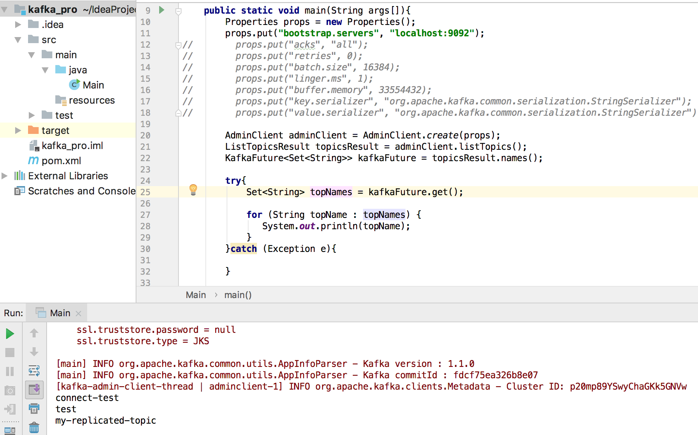

----

启动zookeeper & kafka
```
bin/zookeeper-server-start.sh config/zookeeper.properties

bin/kafka-server-start.sh config/server.properties
```

显示所有topics的程序

```
import org.apache.kafka.clients.admin.*;
import org.apache.kafka.common.KafkaFuture;

import java.util.Properties;
import java.util.Set;

public class Main {

    public static void main(String args[]){
        Properties props = new Properties();
        props.put("bootstrap.servers", "localhost:9092");
//        props.put("acks", "all");
//        props.put("retries", 0);
//        props.put("batch.size", 16384);
//        props.put("linger.ms", 1);
//        props.put("buffer.memory", 33554432);
//        props.put("key.serializer", "org.apache.kafka.common.serialization.StringSerializer");
//        props.put("value.serializer", "org.apache.kafka.common.serialization.StringSerializer");

        AdminClient adminClient = AdminClient.create(props);
        ListTopicsResult topicsResult = adminClient.listTopics();
        KafkaFuture<Set<String>> kafkaFuture = topicsResult.names();

        try{
            Set<String> topNames = kafkaFuture.get();

            for (String topName : topNames) {
               System.out.println(topName);
            }
        }catch (Exception e){

        }

    }
}
```

pom.xml
```
<dependencies>

    <dependency>
        <groupId>org.apache.kafka</groupId>
        <artifactId>kafka-clients</artifactId>
        <version>1.1.0</version>
    </dependency>

    <dependency>
        <groupId>org.apache.kafka</groupId>
        <artifactId>kafka-streams</artifactId>
        <version>1.1.0</version>
    </dependency>

    <dependency>
        <groupId>org.slf4j</groupId>
        <artifactId>slf4j-api</artifactId>
        <version>1.7.25</version>
    </dependency>
    <dependency>
        <groupId>org.slf4j</groupId>
        <artifactId>slf4j-simple</artifactId>
        <version>1.7.25</version>
    </dependency>

</dependencies>
```

运行截图

