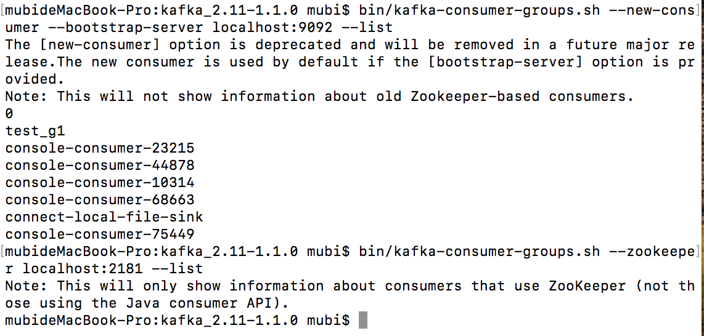
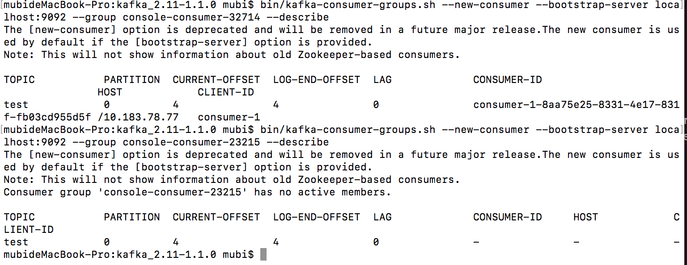
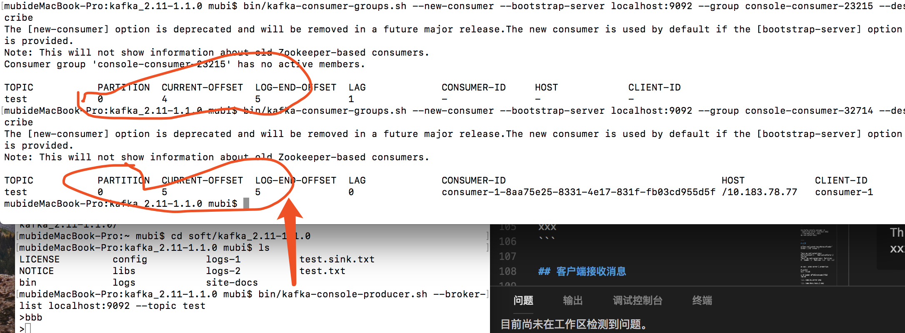

kafka 查看 consumer group 列表

```
bin/kafka-consumer-groups.sh --new-consumer --bootstrap-server localhost:9092 --list

```

```
bin/kafka-consumer-groups.sh --zookeeper localhost:2181 --list
```




查看具体的consumer group信息

```
 bin/kafka-consumer-groups.sh --new-consumer --bootstrap-server localhost:9092 --group <groupname> --describe
```




生产者新产生一条消息



----

kafka-console producer产生消息
```
bin/kafka-console-producer.sh --broker-list localhost:9092 --topic test
```

consumer 消费 名称为：test 的 topic
```
public class Main {

    public static void main(String args[]){

        Properties props = new Properties();
        props.put("bootstrap.servers", "localhost:9092");
        props.put("group.id","test_g1");
        props.put("auto.offset.reset","earliest");
//        props.put("acks", "all");
//        props.put("retries", 0);
//        props.put("batch.size", 16384);
//        props.put("linger.ms", 1);
//        props.put("buffer.memory", 33554432);
//        props.put("key.serializer", "org.apache.kafka.common.serialization.StringSerializer");
        props.put("key.deserializer", "org.apache.kafka.common.serialization.StringDeserializer");
//        props.put("value.serializer", "org.apache.kafka.common.serialization.StringSerializer");
        props.put("value.deserializer", "org.apache.kafka.common.serialization.StringDeserializer");

        KafkaConsumer<String, String> consumer = new KafkaConsumer(props);
        consumer.subscribe(Arrays.asList("test"));
        while (true) {
            ConsumerRecords<String, String> records = consumer.poll(100);
            for (ConsumerRecord<String, String> record : records)
                System.out.printf("offset = %d, key = %s, value = %s%n",
                        record.offset(), record.key(), record.value());
        }

    }
}
```


----