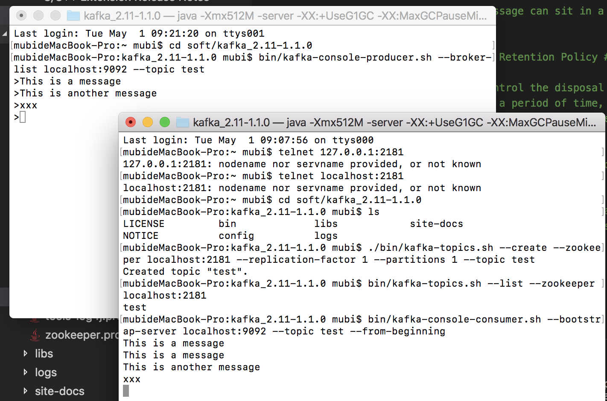

主要基于Linux/Unix系统，这部分按照英文文档，并结合实际操作来介绍，不完全照着文档翻译。

---

Kafka是基于zookeeper的，所以首先要配置zookeeper, 其次是Kafka配置

# zookeeper 单节点配置

conf/zoo.cfg

```
# The number of milliseconds of each tick
tickTime=2000
# The number of ticks that the initial 
# synchronization phase can take
initLimit=10
# The number of ticks that can pass between 
# sending a request and getting an acknowledgement
syncLimit=5
# the directory where the snapshot is stored.
# do not use /tmp for storage, /tmp here is just 
# example sakes.
dataDir=/Users/mubi/soft/zookeeper-3.4.12/data
dataLogDir=/Users/mubi/soft/zookeeper-3.4.12/logs
# the port at which the clients will connect
clientPort=2181
# the maximum number of client connections.
# increase this if you need to handle more clients
#maxClientCnxns=60
#
# Be sure to read the maintenance section of the 
# administrator guide before turning on autopurge.
#
# http://zookeeper.apache.org/doc/current/zookeeperAdmin.html#sc_maintenance
#
# The number of snapshots to retain in dataDir
#autopurge.snapRetainCount=3
# Purge task interval in hours
# Set to "0" to disable auto purge feature
#autopurge.purgeInterval=1
```

启动zookeeper
```
bin/zkServer start
```

# Kafka配置

## Kafka官网下载Kafka release包, 并解压

```
tar -xzf kafka_2.11-1.1.0.tgz
cd kafka_2.11-1.1.0
```

## 启动Kafka服务端

```
bin/kafka-server-start.sh config/server.properties
```

kafka 的 server.properties 中
```
# The id of the broker. This must be set to a unique integer for each broker.
broker.id=0

# The address the socket server listens on. It will get the value returned from 
# java.net.InetAddress.getCanonicalHostName() if not configured.
#   FORMAT:
#     listeners = listener_name://host_name:port
#   EXAMPLE:
#     listeners = PLAINTEXT://your.host.name:9092
#listeners=PLAINTEXT://:9092

# A comma separated list of directories under which to store log files
log.dirs=/Users/mubi/soft/kafka_2.11-1.1.0/logs
```

kafka 配置文件默认使用zookeeper 2181 端口

## 创建topic

创建一个名为： test 的 topic
```
bin/kafka-topics.sh --create --zookeeper localhost:2181 --replication-factor 1 --partitions 1 --topic test
```

查看topic 可使用如下的命令

```
bin/kafka-topics.sh --list --zookeeper localhost:2181
```


## 服务端发送消息

直接在控制台上输入任意的消息

```
bin/kafka-console-producer.sh --broker-list localhost:9092 --topic test
This is a message
This is another message
xxx
```

## 客户端接收消息

消费者消费上述服务端的消息

```
bin/kafka-console-consumer.sh --bootstrap-server localhost:9092 --topic test --from-beginning
```

当服务端不断的发送数据时，客户端能不断的显示接受搭配的消息

运行截图如下


---

# Kafka多broker配置

## 创建server.properties

```
cp config/server.properties config/server-1.properties

cp config/server.properties config/server-2.properties
```

修改其中的内容

config/server-1.properties:
```
    broker.id=1
    listeners=PLAINTEXT://:9093
    log.dir=/tmp/kafka-logs-1
```

config/server-2.properties:
```
    broker.id=2
    listeners=PLAINTEXT://:9094
    log.dir=/tmp/kafka-logs-2
```

## 仍然开启zookeeper单节点
```
mubideMacBook-Pro:zookeeper-3.4.12 mubi$ bin/zkServer.sh start
ZooKeeper JMX enabled by default
Using config: /Users/mubi/soft/zookeeper-3.4.12/bin/../conf/zoo.cfg
Starting zookeeper ... STARTED
```


## 接着开启kafka服务
```
bin/kafka-server-start.sh config/server-1.properties &

bin/kafka-server-start.sh config/server-2.properties &
```


## 创建 topic
```
bin/kafka-topics.sh --create --zookeeper localhost:2181 --replication-factor 2 --partitions 1 --topic my-replicated-topic
```


## 查看topic的broker情况

```
bin/kafka-topics.sh --describe --zookeeper localhost:2181 --topic my-replicated-topic
```


对于 test topic查看
```
bin/kafka-topics.sh --describe --zookeeper localhost:2181 --topic test

Topic:test	PartitionCount:1	ReplicationFactor:1	Configs:
Topic: test	Partition: 0	Leader: 0	Replicas: 0	Isr: 0
```

### leader
"leader" is the node responsible for all reads and writes for the given partition. Each node will be the leader for a randomly selected portion of the partitions.

### replicas
"replicas" is the list of nodes that replicate the log for this partition regardless of whether they are the leader or even if they are currently alive.

### isr
"isr" is the set of "in-sync" replicas. This is the subset of the replicas list that is currently alive and caught-up to the leader.


## 服务端，客户端 控制台消息测试

```
bin/kafka-console-producer.sh --broker-list localhost:9092 --topic my-replicated-topic
```

```
bin/kafka-console-consumer.sh --bootstrap-server localhost:9092 --from-beginning --topic my-replicated-topic
```

----

# 容错测试

名称为my-replicated-topic的topic的leader是 broker 1 ，备份是 broker 2

```
Topic:my-replicated-topic	PartitionCount:1	ReplicationFactor:2	Configs:
Topic: my-replicated-topic	Partition: 0	Leader: 1	Replicas: 1,2	Isr: 1,2
```

```
ps aux | grep server-1.properties

# 杀死上述进程
kill -9 pid
```
接着查看 leader 自动变成了2，consumer依然能正常访问得到消息


----